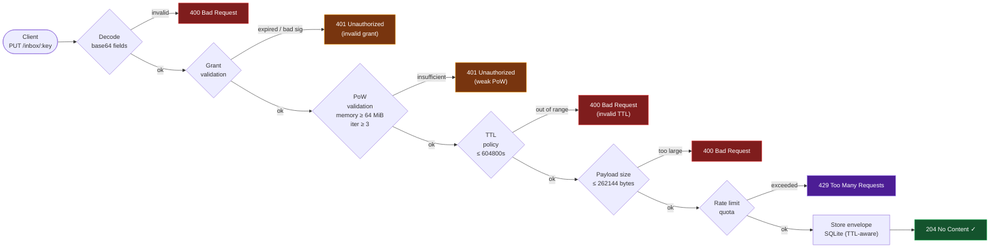
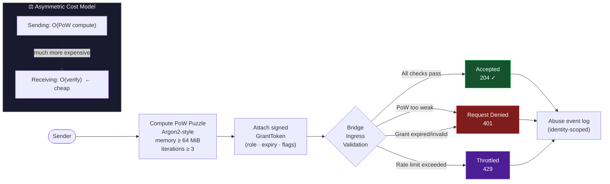

# Bridge HTTP API

## Protocol Alignment (Normative)

SPEX means **Secure Permissioned Exchange**.
SPEX is a **protocol**, not just an application.
Security comes before convenience.
Core cryptographic invariants are non-negotiable.
All architecture and behavior described in this document must remain aligned with:
**Secure. Permissioned. Explicit.**

This document defines current SPEX bridge HTTP endpoints and validation contracts.

## Endpoint Summary

| Method | Path | Description |
| --- | --- | --- |
| PUT | /cards/:card_hash | Store ContactCard payload (base64 canonical CBOR). |
| GET | /cards/:card_hash | Fetch ContactCard by hash. |
| PUT | /slot/:slot_id | Store generic payload blob by hash id. |
| GET | /slot/:slot_id | Fetch stored blob. |
| PUT | /inbox/:key | Store inbox envelope payload. |
| GET | /inbox/:key | List inbox envelopes. |

## Conventions

- Binary payload fields use RFC 4648 base64.
- Signed structures use canonical CBOR/CTAP2.
- Grant and PoW validation are mandatory at ingress.
- Rate limiting and abuse logs are part of bridge policy.

## PUT /cards/:card_hash

Requirements:

- valid, non-expired grant
- valid PoW puzzle
- card_hash must match request data hash

Status codes:

- 204 No Content
- 400 Bad Request
- 401 Unauthorized
- 429 Too Many Requests
- 500 Internal Server Error

## GET /cards/:card_hash

Status codes:

- 200 OK
- 404 Not Found
- 500 Internal Server Error

## PUT /slot/:slot_id

Requirements:

- valid, non-expired grant
- valid PoW puzzle

Status codes:

- 204 No Content
- 400 Bad Request
- 401 Unauthorized
- 429 Too Many Requests
- 500 Internal Server Error

## GET /slot/:slot_id

Status codes:

- 200 OK
- 404 Not Found
- 500 Internal Server Error

## PUT /inbox/:key

Requirements:

- valid, non-expired grant
- valid PoW puzzle
- ttl_seconds within policy (default 86400, max 604800)
- payload max size 262144 bytes

Status codes:

- 204 No Content
- 400 Bad Request
- 401 Unauthorized
- 429 Too Many Requests
- 500 Internal Server Error

## GET /inbox/:key

Response shape:

```json
{
  "items": ["<BASE64_ENVELOPE>", "<BASE64_ENVELOPE>"],
  "next_cursor": 42
}
```

Query params:

- `limit`
- `cursor`
- `max_bytes`

Expired items are omitted.

Recommended status codes:

- 200 OK
- 404 Not Found
- 500 Internal Server Error

## Validation Rules

### Grant validation

- base64 decoding checks
- signature checks
- expiration checks
- role/flags type checks

### Puzzle validation

- required fields must decode correctly
- minimum policy: memory >= 64 MiB, iterations >= 3
- invalid puzzle returns 401

Every payload entering the bridge passes through the following mandatory pipeline:



## Rate Limiting and Abuse Logging

- identity-scoped quotas per time window
- event recording for denied/accepted outcomes



## Client/Transport Bridge Contract

Reference integration flow:

- `spex_transport::inbox::build_bridge_publish_request`
- `spex_transport::inbox::BridgeClient::publish_to_inbox`
- `spex_client::publish_via_bridge`

Expected error classes for clients:

- invalid grant
- invalid/insufficient PoW
- invalid TTL
