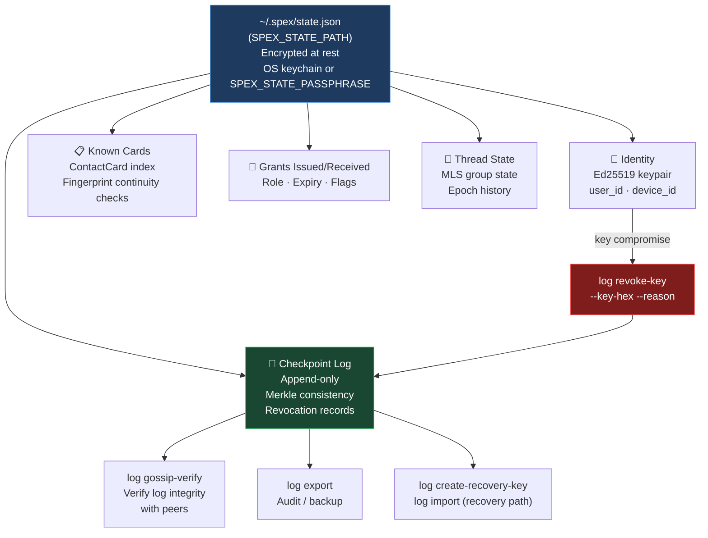

# CLI (spex-cli)

## Protocol Alignment (Normative)

SPEX means **Secure Permissioned Exchange**.
SPEX is a **protocol**, not just an application.
Security comes before convenience.
Core cryptographic invariants are non-negotiable.
All architecture and behavior described in this document must remain aligned with:
**Secure. Permissioned. Explicit.**

This page documents primary CLI commands, local state behavior, and reference usage patterns.

## Local State

Default path:

- `~/.spex/state.json`

Override path with:

- `SPEX_STATE_PATH`

Identity, card, request, grant, thread, and message flows are consolidated through `spex-client`.



## Subcommands

### identity

- `identity new`
- `identity rotate`

### card

- `card create`
- `card redeem --card <BASE64>`

### request

- `request send --to <USER_ID_HEX> --role <N>`

### grant

- `grant accept --request <BASE64>`
- `grant deny --request <BASE64>`

### thread

- `thread new --members <USER_ID_HEX>,<USER_ID_HEX>`

### msg

- `msg send --thread <THREAD_ID_HEX> --text "..."`

Optional bridge flags:

- `--bridge-url <URL>`
- `--ttl-seconds <N>`

Optional P2P flags:

- `--p2p`
- `--peer <MULTIADDR>`
- `--bootstrap <MULTIADDR>`
- `--listen-addr <MULTIADDR>`
- `--p2p-wait-secs <N>`

### inbox

- `inbox poll`
- `inbox poll --inbox-key <HEX_KEY>`
- `inbox poll --bridge-url <URL> --inbox-key <HEX_KEY>`

### log

- `log append-checkpoint`
- `log create-recovery-key`
- `log revoke-key --key-hex <HEX_KEY> --reason "..."`
- `log info`
- `log export --path <LOG_FILE>`
- `log export-abuse --db-path <BRIDGE_DB> --path <FILE.jsonl>`
- `log import --path <LOG_FILE>`
- `log gossip-verify --path <LOG_FILE>`

## Usage Examples

### Basic Flow (card -> request -> grant)

```bash
cargo run -p spex-cli -- identity new
cargo run -p spex-cli -- card create
cargo run -p spex-cli -- card redeem --card <BASE64>
cargo run -p spex-cli -- request send --to <USER_ID_HEX> --role 1
cargo run -p spex-cli -- grant accept --request <BASE64>
```

### Message Flow

```bash
cargo run -p spex-cli -- thread new --members <USER_ID_HEX>,<USER_ID_HEX>
cargo run -p spex-cli -- msg send --thread <THREAD_ID_HEX> --text "hello"
cargo run -p spex-cli -- msg send --thread <THREAD_ID_HEX> --text "hello" --p2p \
  --bootstrap /ip4/127.0.0.1/tcp/9001/p2p/<PEER_ID>
cargo run -p spex-cli -- inbox poll --p2p --inbox-key <HEX_KEY> \
  --peer /ip4/127.0.0.1/tcp/9001/p2p/<PEER_ID>
```

Full transport decision flow (bridge vs P2P vs hybrid): see [docs/diagrams.md — Message Send Flow](diagrams.md#3-message-send-flow).

## Fingerprints

When redeeming a contact card, CLI prints the public-key fingerprint.
Unexpected key changes for known identities should be treated as critical.

## Secure Output Defaults

To reduce accidental data exposure in shell history and CI logs, the CLI now avoids
printing sensitive values in clear text (for example: full card payloads, request/grant
tokens, inbox payload bodies, and recovery keys).

Operational commands print summary metadata (length and digest prefix) so operators can
correlate artifacts without exposing raw secret-bearing material.
