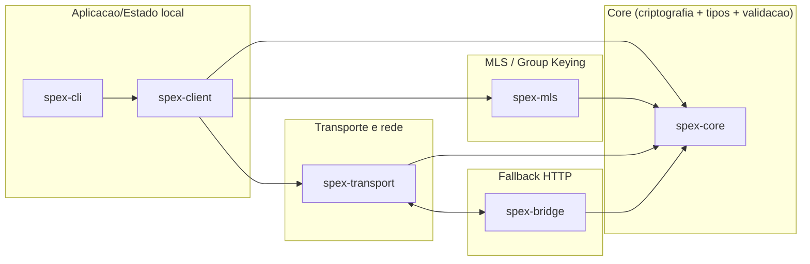
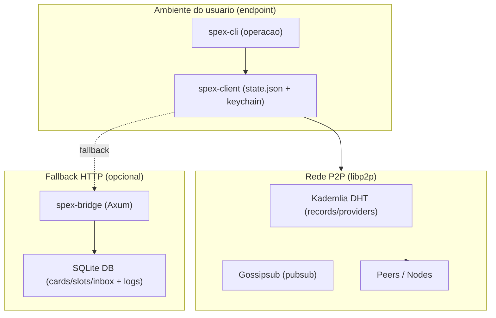
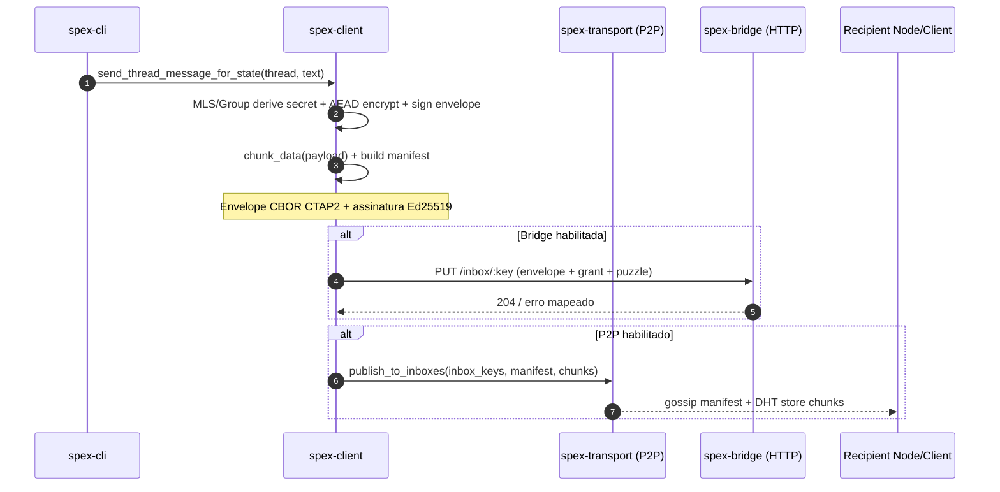
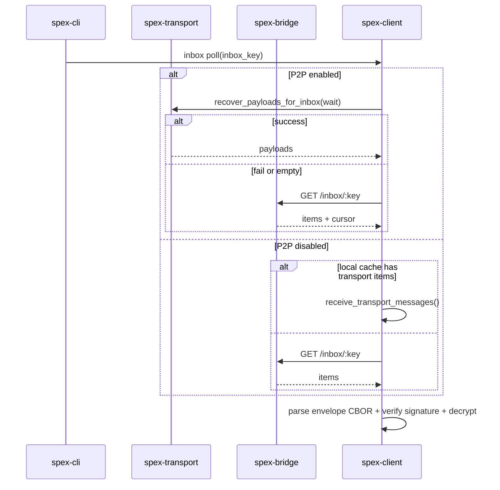
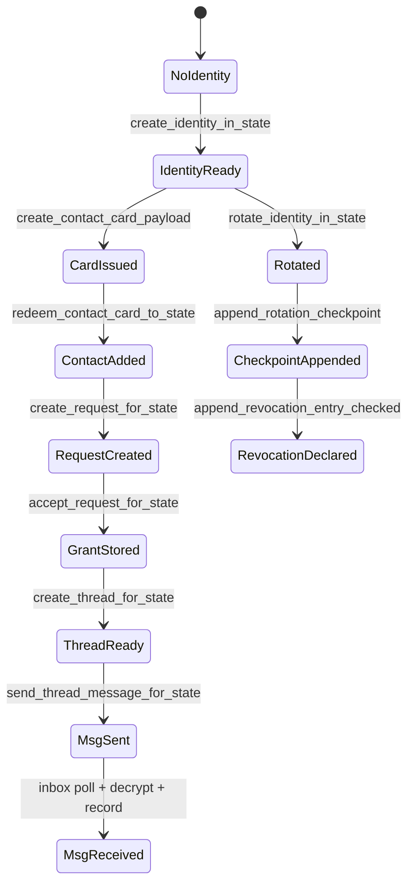

# Documentacao tecnica do projeto SPEX

## Resumo executivo

O **SPEX** e um stack/protocolo de troca segura (com foco em mensageria e artefatos de identidade) implementado em **Rust**, estruturado como um *workspace* com multiplos crates: **spex-core** (tipos/criptografia/validacoes), **spex-mls** (camada de chaves/grupo inspirada em MLS + integracao com *mls-rs*), **spex-transport** (rede P2P com *inbox scanning*, chunking, manifest e fallback), **spex-bridge** (servidor HTTP + SQLite como fallback/ponte), **spex-client** (estado local + APIs de alto nivel) e **spex-cli** (operador/UX via linha de comando).

O projeto assume explicitamente **CBOR canonico no estilo CTAP2** como wire format, principalmente para garantir **serializacao deterministica**, evitando ambiguidades de bytes que quebrariam assinaturas/hashes entre implementacoes. Isso alinha com o racional do CTAP2: CBOR em transportes restritos e um perfil canonico distinto do "Deterministically Encoded CBOR" do RFC 8949.

Em transporte, o SPEX combina dois modelos operacionais:

- **P2P (libp2p)** para descoberta, propagacao e recuperacao (especialmente via Kademlia DHT + PubSub/Gossipsub), com chunking + manifest para controle de integridade e recuperacao por pecas.
- **Fallback via Bridge HTTP** (Axum + SQLite) para ambientes com NAT, conectividade inconsistente ou quando a operacao P2P nao esta disponivel/estavel.

Em **seguranca/anti-abuso**, o projeto aplica **Ed25519** para assinatura, **ChaCha20-Poly1305** para AEAD (estado local e payloads) e **PoW memory-hard com Argon2id** para elevar o custo de spam/abuso (com minimos explicitos).

Status importante: ha um **bloqueio declarado para v1.0 final** ate fechar hardening do runtime P2P, conformidade MLS avancada e expansao de robustez adversarial (fuzz/property tests adicionais).

---

## Visao geral da arquitetura do SPEX

### Componentes do workspace e responsabilidades

O workspace lista explicitamente os crates principais e sugere uma separacao de "nucleo criptografico" vs "transporte" vs "aplicacao/cliente".

| Componente | Papel principal | Superficie externa | Risco dominante |
|---|---|---|---|
| `spex-core` | Tipos CBOR CTAP2, hashing, assinatura, PoW, validacoes, log Merkle | Decoders CBOR + verificacao crypto | Ambiguidade de encoding; validacoes permissivas; panic paths |
| `spex-mls` | Contexto de grupo/epoch/cfg_hash; commits; integracao MLS | Parsing de commits externos; invariantes de epoch | Desync, reorder/replay, gaps de epoch |
| `spex-transport` | P2P inbox scanning, chunking/manifest, ingestao/validacao, fallback HTTP | Rede P2P (gossip/DHT) + HTTP client | Eclipse, spam, inconsistencias de chunk/manifest |
| `spex-bridge` | Bridge HTTP + armazenamento SQLite + rate limit e auditoria | Endpoints HTTP publicos | DDoS, abuso, exfiltracao de metadados |
| `spex-client` | Estado local + crypto de envelope + APIs de alto nivel | Persistencia local + keychain | Vazamento de segredos; corrupcao de estado |
| `spex-cli` | Operacao e demonstracao (identidade, cards, threads, msg, inbox, logs) | CLI (usuario/operador) | Uso incorreto + defaults perigosos |

### Diagramas de arquitetura

#### Diagrama de componentes e dependencias



#### Diagrama de deployment



### Ambientes-alvo: on-prem vs cloud

O repo nao fixa um unico ambiente-alvo; ele permite dois estilos que mudam risco e custo operacional:

- **On-prem**: bridge e peers em rede controlada; reduz exposicao publica de endpoints e diminui ruido/abuso; facilita TLS/mTLS e observabilidade centralizada.
- **Cloud**: bridge acessivel publicamente e peers distribuidos; melhora disponibilidade/alcance, mas amplia superficie de ataque e exige postura seria de rate limit, hardening de TLS, observabilidade e resposta a incidentes.

---

## Protocolo e formatos: por que CTAP2 CBOR, MLS e libp2p

### CTAP2 Canonical CBOR como wire format assinado

O SPEX define wire format em CBOR com **chaves inteiras** e serializacao **canonical CTAP2**, explicitamente para manter ordenacao deterministica e assinaturas estaveis.

**Vantagens**

- **Determinismo de bytes** para assinatura e hash.
- **Payload menor e parsing eficiente** em comparacao a JSON.
- **Interoperabilidade por contrato** via IDs/tipos de campo.

**Desvantagens e trade-offs**

- **Ergonomia pior** para debug que JSON.
- **Compatibilidade delicada** com libs que implementam apenas CBOR deterministico generico.
- **Maior disciplina de validacao** para recusar formatos nao canonicos.

### MLS: por que camada de grupo/epoch

MLS foi desenhado para acordo de chave de grupo assincrono com **Forward Secrecy** e **Post-Compromise Security**, com melhor escala que modelos 1:1.

No SPEX:

- **Identidade/verificacao**: cards e grants assinados + checkpoints para revogacao/recuperacao auditavel.
- **Entrega**: P2P e/ou bridge HTTP como delivery service, com conteudo protegido por envelope + assinatura.

Nota tecnica: o `spex-mls` combina uma estrutura `Group`/`Commit` mais deterministica com integracao `mls-rs` (`MlsRsClient`/`MlsRsGroup`), incluindo regras de epoch gap, resync e parsing de commits externos.

### libp2p: por que Kademlia + Gossipsub

- Kademlia fornece descoberta/distribuicao para registros/provedores.
- Gossipsub oferece propagacao escalavel por topicos com gossip.

Esse modelo e adequado para inbox scanning e recuperacao por manifest/chunks, mas exige maturidade operacional.

### Comparativo rapido

| Camada | Escolha no SPEX | Alternativas comuns | Beneficio principal | Dor principal |
|---|---|---|---|---|
| Serializacao assinada | CTAP2 Canonical CBOR | JSON, Protobuf, CBOR deterministico RFC 8949 | determinismo forte e payload menor | tooling e compatibilidade parcial |
| PK assinatura | Ed25519 | ECDSA P-256, RSA | performance e chaves pequenas | governanca de rotacao/revogacao |
| AEAD | ChaCha20-Poly1305 | AES-GCM | bom desempenho em software | gestao rigorosa de nonce/AD |
| Anti-abuso | Argon2id PoW | rate-limit puro, Hashcash | memory-hard, reduz paralelismo barato | tuning pode penalizar clientes fracos |
| Rede | libp2p (Kademlia + pubsub) | HTTP central, AMQP/Kafka | descentralizacao e tolerancia a falhas | operacao/telemetria mais complexas |

---

## Fluxos de funcionamento: chamadas, mensagens e estados

### Wire objects e IDs CBOR

`docs/wire-format.md` define IDs e tipos CBOR para objetos como `ContactCard`, `InviteToken`, `GrantToken`, `ThreadConfig` e `Envelope`.

Exemplo de `Envelope`: `{0: thread_id, 1: epoch, 2: seq, 3: sender_user_id, 4: ciphertext, 5: signature}`.

### Fluxo de onboarding/confianca

1. **Criar identidade**: `spex-client` gera chaves e metadados.
2. **Emitir card**: gera CBOR canonico assinado e exporta em base64.
3. **Redeem card**: valida assinatura e detecta mudanca de chave por fingerprint.

Ponto critico: mudanca inesperada de chave deve ser tratada como potencial comprometimento e exigir confirmacao/revogacao.

### Fluxo de mensagem: criptografia, chunking e publish

- `send_thread_message_for_state` produz `Envelope + ChunkManifest + Chunks` e registra outbox.
- Publica por bridge (`--bridge-url`) e/ou P2P (`--p2p`).
- Chunking padrao: **32 KiB** com manifest por indice/hash.

#### Sequencia de envio



### Fluxo de inbox polling e fallback

- **Com P2P**: tenta `recover_payloads_for_inbox`; em falha, usa fallback bridge.
- **Sem P2P**: usa cache local se houver; senao consulta bridge.



### Maquina de estados do cliente

`LocalState` inclui identidade, contatos, threads, inbox, requests, grants, checkpoint log e caches de transporte.



---

## Bridge HTTP: contrato, validacoes e operacoes

### Endpoints e contrato

O bridge expoe endpoints para `/cards/:card_hash`, `/slot/:slot_id` e `/inbox/:key` (PUT/GET). A interface e JSON, com binarios em base64; cards/envelopes sao CBOR base64.

Implementa validacao de grant (assinatura/expiracao), validacao de puzzle PoW, rate limiting e log de abuso.

### Rate limit, PoW adaptativo e TTL

- `RateLimitConfig` default: janela 60s, max 120 requests, max ~1 MiB por janela, dificuldade adaptativa por volume/reputacao.
- Inbox TTL: default 1 dia (86400s), max 7 dias (604800s), tamanho maximo do item 256 KiB.

### Exemplo de boot

```rust
let db_path = std::env::var("SPEX_BRIDGE_DB").unwrap_or_else(|_| "spex-bridge.db".to_string());
let state = init_state(db_path)?;
let addr: SocketAddr = "0.0.0.0:3000".parse()?;
```

Recomendacao de producao: parametrizar bind addr/port e usar TLS/mTLS no processo ou via reverse proxy.

---

## Seguranca, robustez adversarial e riscos criticos

### Invariantes centrais

1. Determinismo de encoding para assinatura (CBOR canonical CTAP2).
2. AEAD com AD estruturado para amarrar contexto (`thread_id`, `epoch`, `cfg_hash`, `proto_suite`, `seq`, `sender_id`).
3. Assinatura de envelope e verificacao de autorizacao de remetente na thread.
4. PoW memory-hard (Argon2id).
5. Hardening de parsing com fuzz/property tests.

### Ameacas e mitigacoes

| Ameaca | Vetor | Mitigacao atual | Lacuna provavel |
|---|---|---|---|
| Key substitution | card novo para user_id existente | deteccao por fingerprint e alerta/revogacao | UX/politica de aprovacao |
| Replay/spam no bridge | flood com payloads base64 + PoW fraco | PoW minimo + rate limit + logs | DDoS volumetrico e gargalo de I/O |
| Eclipse/poisoning em P2P | rotas/peers maliciosos | roadmap com anti-eclipse e reputacao | risco alto ate hardening completo |
| Metadata leak | canais sem TLS | exigencia de TLS externo | operacao insegura se ignorado |
| Estado local comprometido | exfiltracao de chaves/threads | state encryption + permissoes de arquivo | risco do endpoint fora do repo |

### Riscos por prioridade

**Risco alto**

- Hardening P2P + observabilidade (bloqueador de v1.0 final).
- Bridge com SQLite sob alta concorrencia.

**Risco medio**

- Compatibilidade CTAP2 canonical em integracoes externas.
- Tuning de PoW (custo vs disponibilidade).

**Risco baixo**

- Escolhas crypto maduras (Ed25519 + ChaCha20-Poly1305), desde que operadas corretamente.

---

## Recomendacoes de uso e checklists de implantacao

### Quando usar / nao usar SPEX

Use SPEX quando precisar de E2E real com canal de entrega potencialmente nao confiavel, operacao hibrida P2P + fallback HTTP, e anti-abuso embutido.

Evite ou segure rollout quando precisar de SLA previsivel imediato em alto volume sem hardening P2P e sem evolucao do backend de bridge.

### Configuracoes recomendadas (baseline)

**Bridge**

- Rodar atras de TLS.
- Ajustar `SPEX_BRIDGE_DB` para volume persistente.
- Monitorar e ajustar limites de request/bytes e impacto no PoW.

**Cliente**

- Preferir `SPEX_STATE_PASSPHRASE_FILE` em vez de passphrase crua em env var.
- Aplicar permissoes restritas no diretorio/arquivo de estado.

**P2P/Transport**

- Adotar perfil client/server no Kademlia conforme topologia real (NAT x roteavel).
- Nao promover para producao sem fechar hardening/observabilidade pendentes.

### Checklist minimo de rollout

- TLS ativo no bridge, logs/metricas e politica de backup/retencao.
- State encryption habilitado no cliente.
- Gates de CI executados (fmt/clippy/tests/readiness/supply chain).
- Fuzz smoke/property tests antes de release.
- Politica de expiracao de grants (`expires_at`) definida e auditavel.

---

## Melhorias arquiteturais recomendadas

### Evolucao do bridge para producao

- Suporte a Postgres (ou backend equivalente) para concorrencia/observabilidade/retencao.
- Jobs de limpeza/expiracao, alem de filtro na leitura.
- mTLS ou assinatura de requests HTTP para cenarios corporativos.

### Evolucao do P2P para realismo operacional

- Metricas e tracing por operacao com correlation id deterministico.
- Estrategia anti-eclipse com scoring/quarentena/snapshot atomico.
- Validacao rigorosa de payloads P2P e expansao de fuzz.

### Maturidade atual

- **Adulto**: disciplina de canonicalizacao/assinatura, validacoes explicitas, fuzz/property tests e gates de CI.
- **Adolescente**: P2P em producao sem hardening completo, churn testing e observabilidade total.
