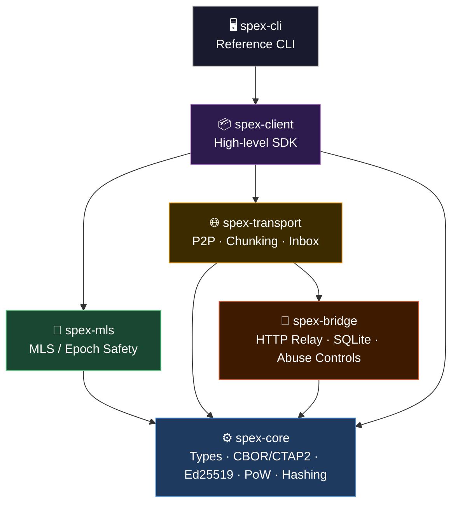
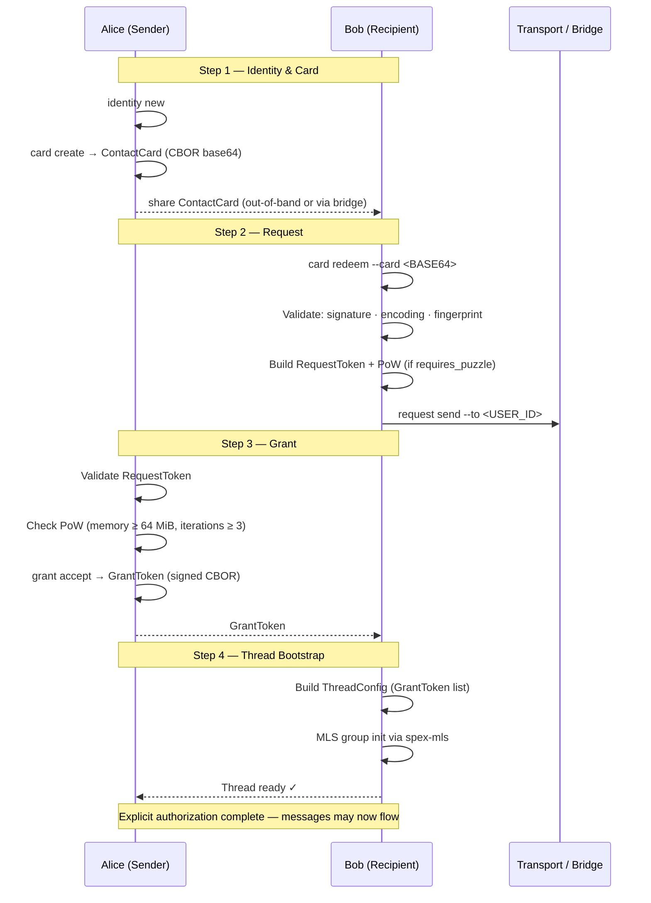
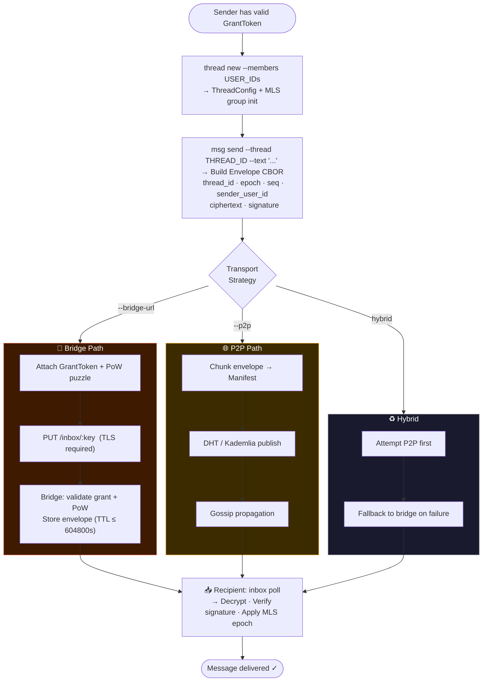
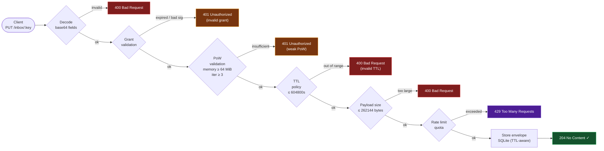
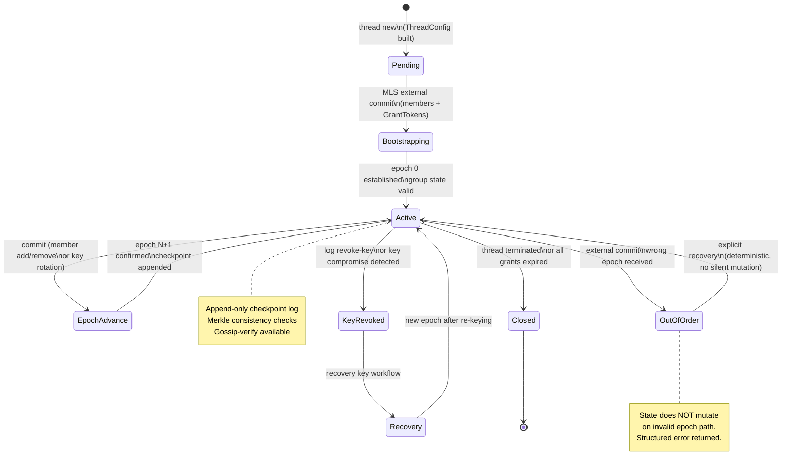
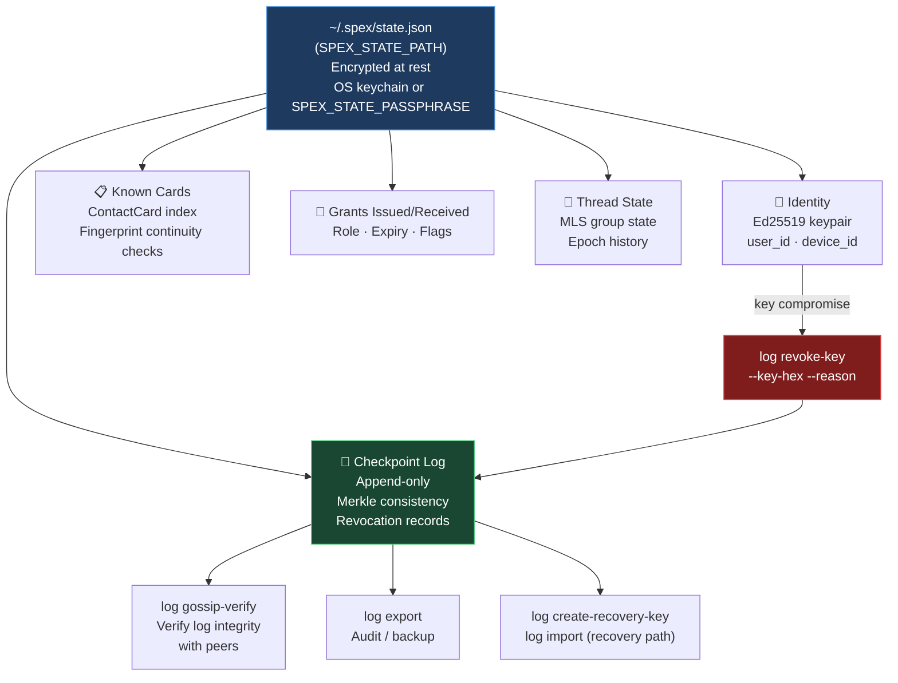
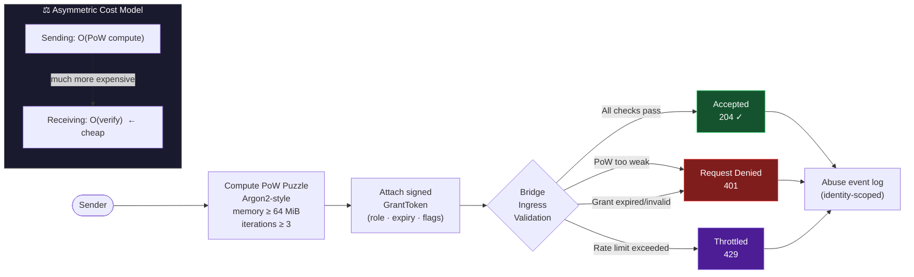

# SPEX — Flows & Workflows

Visual reference for the SPEX protocol flows. Use these diagrams alongside [docs/overview.md](overview.md) and [docs/integration.md](integration.md).

---

## 1. System Architecture

Crate layering and dependency directions.

---

## 2. Handshake Flow — Contact → Request → Grant

Explicit permission exchange before any message can be sent.

---

## 3. Message Send Flow

Thread creation and message delivery with transport selection.

---

## 4. Bridge Validation Pipeline

Every payload entering the bridge passes through mandatory checks.

---

## 5. MLS Thread Lifecycle

Epoch progression and safety controls in `spex-mls`.

---

## 6. Local State & Key Management (CLI)

How identity, cards, and log state are managed locally.

---

## 7. Anti-Spam & Abuse Controls

Economic friction model that makes message initiation costly.

