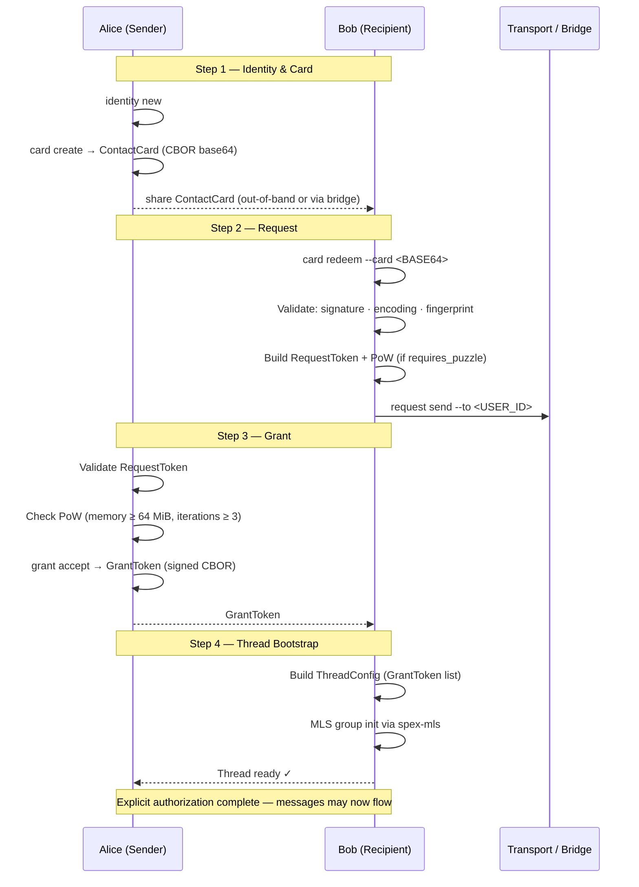
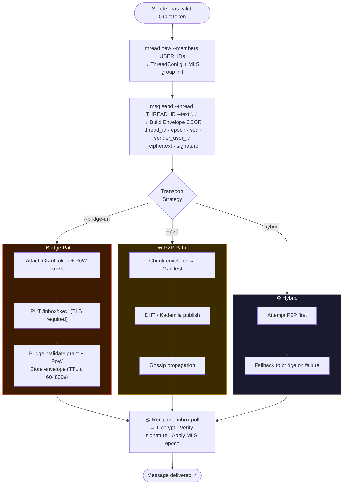

# Integration

## Protocol Alignment (Normative)

SPEX means **Secure Permissioned Exchange**.
SPEX is a **protocol**, not just an application.
Security comes before convenience.
Core cryptographic invariants are non-negotiable.
All architecture and behavior described in this document must remain aligned with:
**Secure. Permissioned. Explicit.**

This guide covers card validation, request/grant flow, thread creation, message exchange, and API-oriented integration patterns.

## Contact Cards

### Generation

Build cards in canonical CBOR (CTAP2 profile), then encode as base64 for transport.

### Validation

Validate on import:

- canonical encoding
- signature (when present)
- fingerprint continuity for known identities

## Request and Grant

Reference flow:

1. Receive ContactCard/InviteToken.
2. Build RequestToken with PoW when required.
3. Validate request and issue signed GrantToken.
4. Create ThreadConfig and start MLS-protected flow.

Use shared validation primitives from core/transport before accepting untrusted payloads.

## Thread and Message Flow

- Build ThreadConfig from validated grants.
- Serialize envelope in canonical CBOR.
- Publish through P2P, bridge, or hybrid strategy.

## Non-Rust Integration Requirements

- canonical CBOR/CTAP2 encoding only
- deterministic signatures/hashes
- strict schema and type validation
- base64 transport encoding for binary payloads
- TLS for bridge/external APIs

## MLS Out-of-Order and Recovery Policy

- Out-of-order external commits must return explicit structured errors.
- Local state must not mutate on invalid order/epoch paths.
- Recovery must be explicit and deterministic.

## Advanced MLS Compliance References

See:

- `docs/mls-advanced-scenarios-matrix.md`
- `crates/spex-mls/tests/planned_concurrent_updates.rs`
- `crates/spex-mls/tests/mls_advanced_negative.rs`

## Bridge Publish Contract (Inbox)

Recommended flow:

- `spex_transport::inbox::build_bridge_publish_request`
- `spex_transport::inbox::BridgeClient::publish_to_inbox`
- `spex_client::publish_via_bridge`

Contract summary:

- method: `PUT /inbox/:hex_sha256(inbox_key_seed)`
- required fields: `data`, `grant`, `puzzle`
- optional field: `ttl_seconds`

Expected error classes:

- invalid grant
- invalid/insufficient PoW
- invalid TTL policy
