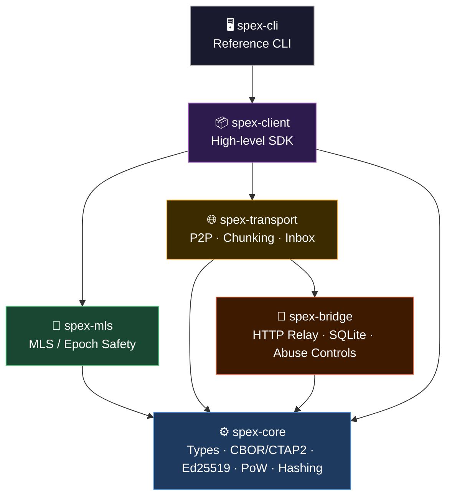
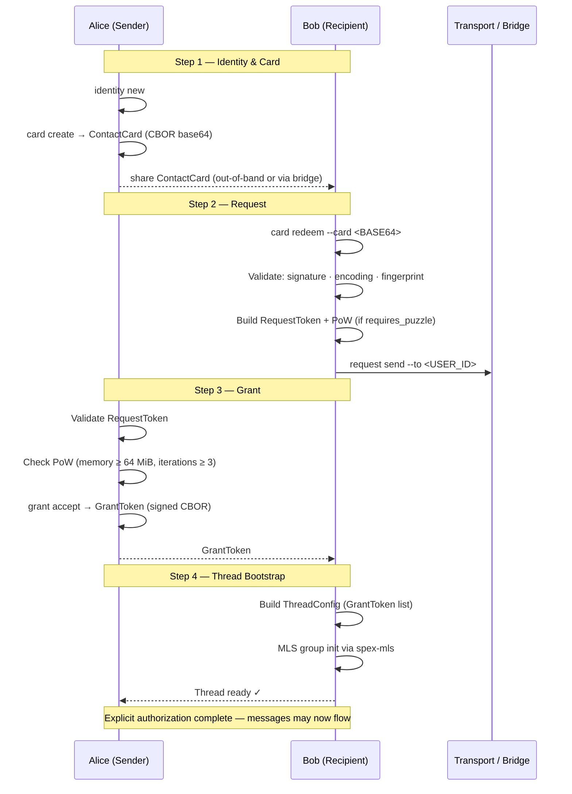
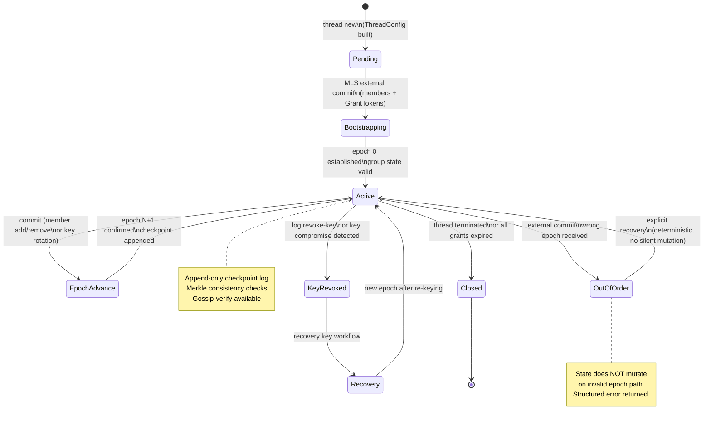

# Architecture Overview

## Protocol Alignment (Normative)

SPEX means **Secure Permissioned Exchange**.
SPEX is a **protocol**, not just an application.
Security comes before convenience.
Core cryptographic invariants are non-negotiable.
All architecture and behavior described in this document must remain aligned with:
**Secure. Permissioned. Explicit.**

SPEX is organized in layers to preserve modularity and interoperability.
The crate split allows transport/runtime evolution without weakening wire-format or authentication guarantees.

## Main Layers

1. Core (types and formats)
   - Canonical types (cards, tokens, envelopes, checkpoints).
   - Canonical CBOR/CTAP2 for deterministic signatures and hashes.
2. Security and identity
   - Ed25519 signatures, hashing, PoW validation, grant validation.
   - Append-only checkpoint log with Merkle consistency checks.
3. MLS and message layer
   - Thread lifecycle, commits, group state safety, encrypted payload flow.
4. Transport
   - Chunking/manifests, DHT/Kademlia, gossip, inbox scanning.
   - HTTP bridge fallback for delivery/retrieval.
5. Tooling
   - CLI and SDK flows for request/grant/thread/message operations.

## Crate Map

- spex-core: protocol types, canonical CBOR, crypto and validation primitives.
- spex-mls: MLS integration, external-commit handling, epoch safety controls.
- spex-transport: P2P transport runtime, chunk/manifests, fallback/recovery helpers.
- spex-bridge: HTTP bridge with SQLite persistence and abuse controls.
- spex-cli: reference operational interface.
- spex-client: high-level SDK for application integrations.

## Handshake Flow (Request/Grant)

1. Initial contact: sender shares a ContactCard (CBOR base64) or an InviteToken.
2. Request: sender submits a RequestToken (JSON base64).
3. Grant: recipient validates request and issues signed GrantToken (canonical CBOR base64).
4. MLS thread: grant is used in ThreadConfig to bootstrap secure group communication.

This flow enforces explicit authorization before message exchange.

## MLS Thread Lifecycle

## Local Persistence

CLI local state is stored in ~/.spex/state.json (or SPEX_STATE_PATH).
State is encrypted using OS keychain material, or SPEX_STATE_PASSPHRASE fallback.

## Fingerprints

When importing cards, verify public-key fingerprint continuity.
Unexpected key changes should be treated as critical events.

## Transport and TLS

All external integrations must use TLS.
Transport protection complements, but never replaces, protocol-level signature and context validation.
